 

I run cloud platforms at organization scale and make cost, security, and reliability
**enforceable** — not aspirational. My work sits where platform engineering, FinOps,
and governance meet: guardrails that fail closed, evidence that survives an audit, and
automation that takes humans out of the critical path.

Principles I build by:

| Principle | Why it holds |
|---|---|
| Policy engines over runbooks | SCPs and Kyverno *enforce*; documents get forgotten |
| Fail closed or it isn't safety | If the system can't verify, it stops — no silent pass |
| Document *why-not*, not just *how* | Rejected options are what stop repeated mistakes |
| Evidence over assertion | A claim without a check is a hope, not a control |

- **150+ AWS accounts** governed through Control Tower + AFT — policy-gated vending with cost attribution baked in from account zero.
- **Kubernetes at scale** — multi-tenant EKS with Karpenter, Kyverno guardrails, and per-namespace budgets so no tenant outspends its envelope.
- **Evidence-based FinOps** — surfaced **$500K+/yr** in defensible savings (RI/SP coverage, Graviton, gp2→gp3, storage lifecycle), each with a proof step before it ships.
- **Org-wide security posture** — own the preventive→detective→audit stack: SCPs and IAM/OIDC guardrails, centralized GuardDuty + Security Hub + AWS Config across ~115 accounts, KMS/encryption and WAF baselines — all Terraform-managed and drift-free.
- **Fail-closed automation** — SARIF findings, OIDC-scoped access, and production canaries instead of sandbox benchmarks that lie.

<table>
<tr>
<td width="50%" valign="top">

**🛰️ [cloud-finops-agent](https://github.com/prmaddi6233/cloud-finops-agent)**

Tiered validation engine — math, metrics, then a production canary. SARIF findings, fail-closed, OIDC.

`Python` · `SARIF` · `GitHub Actions` · `OIDC`

[Blog](https://github.com/prmaddi6233/cloud-finops-agent/blob/main/docs/blog-why-sandbox-benchmarks-fail.md) · [ADRs](https://github.com/prmaddi6233/cloud-finops-agent/tree/main/docs/adr)

</td>
<td width="50%" valign="top">

**☁️ [aws-platform-control-plane](https://github.com/prmaddi6233/aws-platform-control-plane)**

Self-service account lifecycle — policy-gated provisioning, Step Functions, full audit trail.

`Python` · `Step Functions` · `DynamoDB`

</td>
</tr>
<tr>
<td width="50%" valign="top">

**🏭 [aws-aft-account-factory-blueprint](https://github.com/prmaddi6233/aws-aft-account-factory-blueprint)**

Secure, cost-attributed account vending on Control Tower + AFT.

`Terraform` · `Control Tower` · `AFT`

</td>
<td width="50%" valign="top">

**☸️ [eks-cost-governance-toolkit](https://github.com/prmaddi6233/eks-cost-governance-toolkit)**

Kyverno guardrails + budgeted namespaces for multi-tenant EKS.

`Kubernetes` · `Kyverno` · `Helm` · `OpenCost`

</td>
</tr>
</table>

| Domain | Tools |
|---|---|
| **Cloud** | AWS (Organizations · Control Tower · IAM · EKS · Lambda) · Azure · GCP |
| **Containers** | Kubernetes · EKS · Karpenter · Kyverno · Helm · ArgoCD · OpenCost |
| **IaC** | Terraform · OpenTofu · Terragrunt · CloudFormation · Spacelift · Ansible |
| **CI/CD** | GitHub Actions · CodePipeline · Step Functions · EventBridge |
| **FinOps** | FOCUS 1.2 · CUR 2.0 · Athena · QuickSight · Cost Explorer · Savings Plans · Graviton |
| **Security** | SCPs · IAM · OIDC · GuardDuty · Security Hub · AWS Config · KMS · WAF · SARIF |
| **Observability** | Grafana · Prometheus · CloudWatch · Datadog |
| **Languages** | Python · Bash · Go · SQL · HCL |

| | Piece | Theme |
|---|---|---|
| 📡 | [Why Sandbox Benchmarks Don't Validate What They Claim](https://github.com/prmaddi6233/cloud-finops-agent/blob/main/docs/blog-why-sandbox-benchmarks-fail.md) | FinOps · Validation |
| 📐 | [The Agent Is Not the Control Plane](https://github.com/prmaddi6233/cloud-finops-agent/blob/main/docs/adr/0002-agent-is-not-the-control-plane.md) | Security · Architecture |
| 📐 | [Tiered Validation Model](https://github.com/prmaddi6233/cloud-finops-agent/blob/main/docs/adr/0003-tiered-validation-model.md) | Systems Design |

*Open to **Principal / Senior Cloud Platform Engineering**, **AWS Architecture**, and **FinOps** roles.*

 

