 

 

**Cloud Platform Engineer · FinOps** &nbsp;·&nbsp; Calgary, Canada 🇨🇦 &nbsp;·&nbsp; 150+ account AWS Organization

 

I make cost, security, and reliability **enforceable** — not aspirational.

My work sits where platform engineering, FinOps, and governance meet: guardrails that fail closed, evidence that survives an audit, and automation that takes humans out of the critical path.

 

 

> 🚀 **Currently shipping →** [cloud-finops-agent](https://github.com/prmaddi6233/cloud-finops-agent) — tiered, fail-closed cost validation with production canaries and SARIF findings. [Read why →](https://github.com/prmaddi6233/cloud-finops-agent/blob/main/docs/blog-why-sandbox-benchmarks-fail.md)

 

<b>Principles I build by</b>

 

| Principle | Why it holds |
|---|---|
| Policy engines over runbooks | SCPs and Kyverno *enforce*; documents get forgotten |
| Fail closed or it isn't safety | If the system can't verify, it stops — no silent pass |
| Document *why-not*, not just *how* | Rejected options are what stop repeated mistakes |
| Evidence over assertion | A claim without a check is a hope, not a control |

 

 

150+ AWS accounts · $500K+/yr identified savings · 100% IaC-managed

 

🏢 **150+ AWS accounts** — Control Tower + AFT, policy-gated vending, cost attribution from day one.

☸ **Kubernetes at scale** — Multi-tenant EKS with Karpenter, Kyverno guardrails, per-namespace budgets.

💰 **$500K+/yr savings** — RI/SP coverage, Graviton, gp2→gp3, storage lifecycle — each with a proof step.

🛡️ **Org-wide security** — IAM Identity Center, SCPs, GuardDuty + Security Hub + Config across all accounts.

⚙️ **Fail-closed automation** — SARIF findings, OIDC-scoped access, production canaries.

 

 

<table>
<tr>
<td width="50%" valign="top">
 

**🛠️ [cloud-finops-agent](https://github.com/prmaddi6233/cloud-finops-agent)**

Tiered validation — math, metrics, production canary.
SARIF findings. Fail-closed. OIDC.

`Python` · `SARIF` · `GitHub Actions`

[📝 Blog](https://github.com/prmaddi6233/cloud-finops-agent/blob/main/docs/blog-why-sandbox-benchmarks-fail.md) · [📐 ADRs](https://github.com/prmaddi6233/cloud-finops-agent/tree/main/docs/adr)

 
</td>
<td width="50%" valign="top">
 

**☁️ [aws-platform-control-plane](https://github.com/prmaddi6233/aws-platform-control-plane)**

Self-service account lifecycle.
Policy-gated. Step Functions. Audit trail.

`Python` · `Step Functions` · `DynamoDB`

 
</td>
</tr>
<tr>
<td width="50%" valign="top">
 

**🏭 [aws-aft-account-factory-blueprint](https://github.com/prmaddi6233/aws-aft-account-factory-blueprint)**

Secure, cost-attributed account vending.
Control Tower + AFT.

`Terraform` · `Control Tower` · `AFT`

 
</td>
<td width="50%" valign="top">
 

**☸️ [eks-cost-governance-toolkit](https://github.com/prmaddi6233/eks-cost-governance-toolkit)**

Kyverno guardrails + budgeted namespaces.
Multi-tenant EKS cost governance.

`Kubernetes` · `Kyverno` · `Helm`

 
</td>
</tr>
</table>

 

**Cloud**  

**Containers & Orchestration**  

**Infrastructure as Code**  

**CI/CD & Automation**  

**FinOps & Cost**  

**Security & Access**  

**Observability**  

**Languages**  

| | Piece | Theme |
|---|---|---|
| 📡 | [Why Sandbox Benchmarks Don't Validate What They Claim](https://github.com/prmaddi6233/cloud-finops-agent/blob/main/docs/blog-why-sandbox-benchmarks-fail.md) | FinOps · Validation |
| 📐 | [The Agent Is Not the Control Plane](https://github.com/prmaddi6233/cloud-finops-agent/blob/main/docs/adr/0002-agent-is-not-the-control-plane.md) | Security · Architecture |
| 📐 | [Tiered Validation Model](https://github.com/prmaddi6233/cloud-finops-agent/blob/main/docs/adr/0003-tiered-validation-model.md) | Systems Design |

*Open to **Principal / Senior Cloud Platform Engineering**, **AWS Architecture**, and **FinOps** roles.*

 

