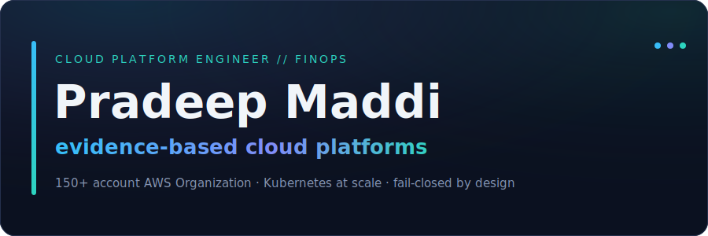

&nbsp;

&nbsp;

I design and operate AWS platforms (**150+ accounts**) that are repeatable, policy-aligned, observable, and cost-aware from the start — making the secure, cost-efficient path the *easiest* path for product teams without slowing delivery.

**My thesis:** cost recommendations rot in backlogs because nobody proves they're safe. The interesting work is the evidence layer — deterministic checks where math suffices, production metrics where it doesn't, and canary validation with automated rollback where it matters.

> ▹ Decisions get written down — *"why not X"* beats *"how to X"*
> ▹ Guardrails live in config and policy engines, not runbooks
> ▹ A safety claim that can't fail closed isn't a safety claim

&nbsp;

| When | Role | Highlights |
|------|------|------------|
| **2024 — now** | **Cloud Platform Engineer** · Pollard Banknote | 150+ account AWS Org · FinOps practice & CUR/FOCUS/CUR 2.0 dashboards · Terraform automation (−70% deploy time) · −20% monthly cost via reserved capacity + right-sizing |
| **2023** | Cloud Engineer · Viasat | Jenkins + Terraform automation (−80% deploy) · IAM hardening (−30% unauthorized access) · Kubernetes optimization |
| **2021 — 23** | Cloud Engineer · Inmarsat | Reserved-instance strategy (−$10k/mo) · monitoring (−20% downtime) · CloudFormation/Terraform (−80% manual effort) |
| **2019 — 21** | Cloud Engineer · Cisco | CloudWatch optimization (−$50k/mo) · Okta SSO across 20+ apps · IaC with Bamboo/Jenkins (−50% provisioning) |
| **2017 — 19** | Linux System Administrator · Lotus Info Tech | 20+ servers · 20,000+ user accounts · automation saving ~15 hrs/week |

Full detail with metrics → <b><a href="https://prmaddi6233.github.io">prmaddi6233.github.io</a></b>

&nbsp;

<table>
<tr>
<td width="50%" valign="top">

#### 🏆 [cloud-finops-agent](https://github.com/prmaddi6233/cloud-finops-agent)
Tiered validation engine that proves FinOps recommendations are safe using math, metrics, and production canary — not synthetic benchmarks. SARIF findings, fail-closed by design.

`Python` · `SARIF` · `GitHub Actions` · `OIDC`

</td>
<td width="50%" valign="top">

#### [aws-platform-control-plane](https://github.com/prmaddi6233/aws-platform-control-plane)
Self-service account lifecycle — policy-gated provisioning and decommissioning, Step Functions orchestration, least-privilege IAM, deterministic audit trail.

`Python` · `Step Functions` · `DynamoDB` · `IAM`

</td>
</tr>
<tr>
<td width="50%" valign="top">

#### [aws-aft-account-factory-blueprint](https://github.com/prmaddi6233/aws-aft-account-factory-blueprint)
Automated, secure, cost-attributed AWS account vending via Control Tower + AFT. Platform, security, and FinOps in one pipeline.

`Terraform` · `Control Tower` · `AFT`

</td>
<td width="50%" valign="top">

#### [eks-cost-governance-toolkit](https://github.com/prmaddi6233/eks-cost-governance-toolkit)
Kyverno policy-as-code guardrails + budgeted namespaces (ResourceQuota / LimitRange) and OpenCost for multi-tenant EKS.

`Kubernetes` · `Kyverno` · `Helm` · `OpenCost`

</td>
</tr>
</table>

&nbsp;

<b>Also fluent in</b> &nbsp;·&nbsp; Amazon EKS &nbsp;·&nbsp; Helm &nbsp;·&nbsp; OpenTofu &nbsp;·&nbsp; Spacelift &nbsp;·&nbsp; Kyverno &nbsp;·&nbsp; Control Tower / AFT &nbsp;·&nbsp; Athena &nbsp;·&nbsp; QuickSight &nbsp;·&nbsp; FOCUS / CUR 2.0 &nbsp;·&nbsp; OIDC

&nbsp;

&nbsp;

Whether it's platform engineering, FinOps, or an interesting problem in cloud cost governance — my inbox is open.

---

### 📊 GitHub Analytics

### 🐍 Contribution Snake

<picture>
  <source media="(prefers-color-scheme: dark)" srcset="https://raw.githubusercontent.com/prmaddi6233/prmaddi6233/output/github-snake-dark.svg" />
  <source media="(prefers-color-scheme: light)" srcset="https://raw.githubusercontent.com/prmaddi6233/prmaddi6233/output/github-snake.svg" />
  
</picture>

 

